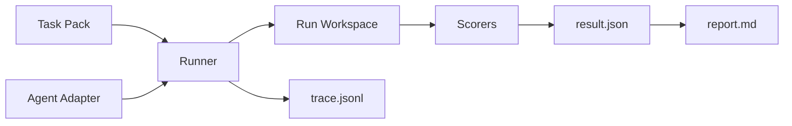

# Coding Agent Exam

A lightweight evaluation framework prototype for Coding Agents and LLM Agents.

It defines small engineering tasks, runs an agent adapter against toy repos,
records trace evidence, applies multi-dimensional scorers, and generates
Markdown/JSON reports that are easy to inspect in a portfolio or code review.

## Why This Exists

Most public benchmarks are too large for a personal developer workflow. This
project focuses on the local loop that matters when evaluating a coding agent:

- task definition
- constrained repo edits
- deterministic verification
- patch diff evidence
- trace logging
- multi-dimensional scoring
- reproducible reports

It is not a leaderboard and does not require cloud infrastructure.

## Core Features

- Task packs with `task.yaml`, toy repo, tests, expected behavior, and rubric.
- Runner CLI: `python -m agent_exam run --task-pack <path>`.
- Mock agent adapter for deterministic sample runs.
- Standard-library test execution through task-defined commands.
- Rule, test, diff, and optional LLM-judge scorer interfaces.
- JSONL trace, JSON result, patch diff, and Markdown report artifacts.
- Local-first privacy posture with no default remote API calls.

## Architecture



## Quick Start

Run the bugfix sample:

```text
python -m agent_exam run --task-pack examples/task_packs/basic_bugfix
```

Run the feature-addition sample:

```text
python -m agent_exam run --task-pack examples/task_packs/feature_addition
```

Run all sample task packs:

```text
python -m agent_exam run --task-pack examples/task_packs
```

Regenerate a report:

```text
python -m agent_exam report --run-id <run_id>
```

Task 001 legacy check still works:

```text
python scripts/check_task_001.py
```

Run project tests:

```text
python -m unittest discover tests
```

## Development Verification

The GitHub Actions CI workflow runs on pushes and pull requests to `main` with
Python 3.11 and 3.12. It runs the unittest suite, the Task 001 check, and a
standard-library `compileall` syntax check.

## Generated Evidence

Each run writes:

- `runs/<run_id>/result.json`
- `runs/<run_id>/trace.jsonl`
- `runs/<run_id>/report.md`
- `runs/<run_id>/patch.diff`
- `runs/<run_id>/test_output.txt`

Fixed sample outputs for GitHub review are stored under:

- `docs/sample_reports/sample-basic-bugfix/report.md`
- `docs/sample_reports/sample-basic-bugfix/result.json`
- `docs/sample_reports/sample-feature-addition/report.md`
- `docs/sample_reports/sample-feature-addition/result.json`

To regenerate the same local run IDs:

```text
python -m agent_exam run --task-pack examples/task_packs/basic_bugfix --run-id sample-basic-bugfix
python -m agent_exam run --task-pack examples/task_packs/feature_addition --run-id sample-feature-addition
```

## Adding a Task

Create a directory under `examples/task_packs/` with:

- `task.yaml`
- `repo/`
- `tests/`
- `expected_behavior.md`
- `rubric.md`

`task.yaml` uses a JSON-compatible YAML subset so the harness stays
standard-library only. Include `id`, `title`, `scenario`, `difficulty`,
`repo_path`, `instructions`, `success_criteria`, `allowed_tools`,
`expected_outputs`, and `scoring_profile`.

## Adding a Scorer

Implement `agent_exam.scorers.base.Scorer` and return a `ScoreResult`.

Current scorers:

- `TestScorer`: runs the configured local test command.
- `RuleScorer`: checks required files and text patterns.
- `DiffScorer`: evaluates changed files and diff size.
- `LLMJudgeScorer`: optional skeleton, skipped by default.

## Privacy Model

The default posture is local-first. The sample mock agent and scorers do not
upload repository content. OpenAI-compatible adapters are skeletons unless a
future user explicitly configures remote API use.

Do not store secrets, tokens, credentials, or account settings in task packs,
run artifacts, or reports.

## Current Boundaries

- The mock agent proves the harness loop; it is not a real autonomous coding
  agent or real multi-model benchmark.
- Task specs are parsed as JSON-compatible YAML to avoid third-party packages.
- LLM judge scoring is optional and skipped by default.
- No Web UI, database, leaderboard, sandbox isolation, or cloud runner.

## Roadmap

- Add a real local model adapter behind the same agent interface.
- Support task packs containing multiple tasks.
- Add stronger patch application and sandbox isolation.
- Add richer failure analysis from trace events.
- Add optional HTML report generation.
