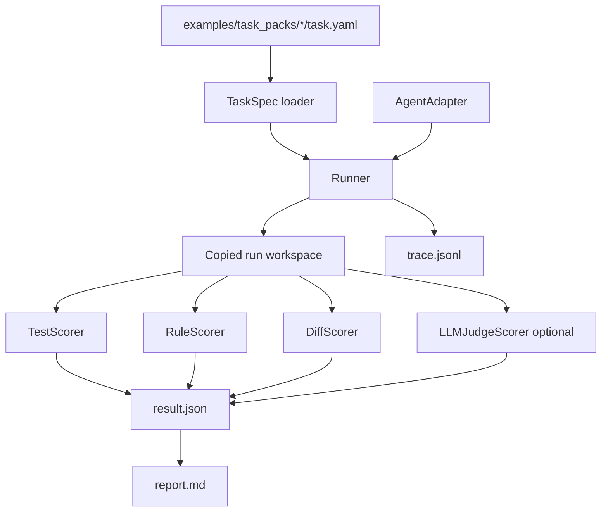

# Architecture

## Positioning

`coding-agent-exam` is a lightweight Coding Agent / LLM Agent Evaluation
Harness prototype for personal developer workflows.

It is not a public leaderboard or a large benchmark platform. It is designed to
make local agent runs reproducible: define a task, run an adapter, capture trace
events, score the result, and generate artifacts a human can inspect.

## Runtime Flow

## Components

- `agent_exam.core`: task, run, result, and trace data structures.
- `agent_exam.adapters`: mock agent and OpenAI-compatible adapter skeletons.
- `agent_exam.scorers`: test, rule, diff, and optional judge scoring.
- `agent_exam.reports`: JSON and Markdown report generation.
- `examples/task_packs`: runnable toy repo tasks; the CLI can run one task pack
  or every child task pack under a directory.
- `runs`: local generated evidence for each run.
- `docs`: architecture, scoring, privacy, and resume-facing notes.

## Data Model

- `TaskSpec`: task id, scenario, repo path, instructions, expected outputs, and
  scoring profile.
- `RunConfig`: represented by CLI args for task pack, agent name, output dir,
  max steps, and timeout.
- `RunResult`: run metadata, scores, artifacts, trace path, report path, errors,
  final score, and failure taxonomy.
- `ScoreResult`: one scorer's score, pass/fail flag, evidence, and comments.
- `TraceEvent`: timestamped JSONL event for task loading, agent actions,
  scoring, and report generation.

## Scoring Model

Default scoring combines deterministic evidence first:

- Test score: 45%
- Rule score: 25%
- Diff score: 15%
- Optional judge score: 15%

If the optional judge is skipped, the implemented scorers are renormalized.

## Privacy Boundary

The default execution path uses only local files, standard-library subprocesses,
and the mock agent. The OpenAI-compatible adapter is a skeleton and does not
perform real remote calls by default.

Remote API use must be explicitly configured in future iterations and must not
upload secrets, tokens, credentials, or account settings.

## Current Limits

- One task per task-pack directory; directory-level batch runs are supported by
  running child task packs one at a time.
- Mock agent has deterministic recipes for sample tasks only.
- No sandbox isolation beyond copying task files into `runs/<run_id>/workspace`.
- No HTML report yet.
- No real LLM judge execution yet.
